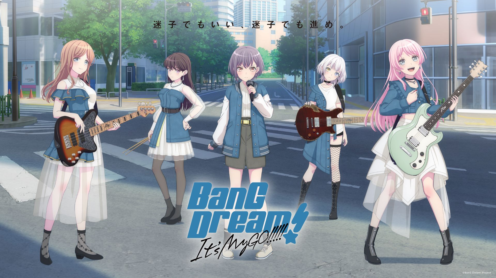
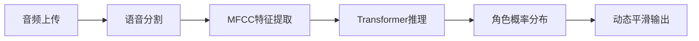

# MyGO!!!!! 语音识别系统



## 🚀 项目介绍

本系统是基于Transformer架构的《BanG Dream! It's MyGO!!!!!》角色语音识别解决方案，整合了以下核心技术：

🔥 **核心架构**
- 12层Transformer Encoder堆叠结构
- 40维MFCC语音特征提取
- 动态时间规整(DTW)对齐算法
- 基于注意力机制的特征融合

✨ **功能亮点**



## 🎥 效果演示
```html
<video controls width="80%" style="display:block; margin:20px auto; border-radius:8px;">
  <source src="./demo.mp4" type="video/mp4">
  您的浏览器不支持视频播放
</video>
```

## 特性
- 🎤 支持MyGO!!!!!全员语音识别
- 🔥 98%以上的测试准确率
- ⚡ 实时推理响应

## 快速开始
```bash
# 安装依赖
pip install -r requirements.txt

# 启动服务
python app.py
```

## 📂 项目结构
```bash
├── 📁 data/              # 音频数据集（WAV格式）
├── 📁 model/             # 预训练模型参数
├── 📁 uploads/           # 用户上传文件存储
├── 📄 app.py             # Flask REST API入口
├── 📄 model.py           # Transformer模型架构
├── 📄 utils.py           # 音频处理工具箱
├── 📄 requirements.txt   # Python依赖库清单
└── 📄 README.md          # 项目文档
```

## 🚀 性能指标

| 指标                | 数值                  |
|---------------------|-----------------------|
| 训练设备            | NVIDIA RTX 3090       |
| 训练轮次            | 50 epochs              |

